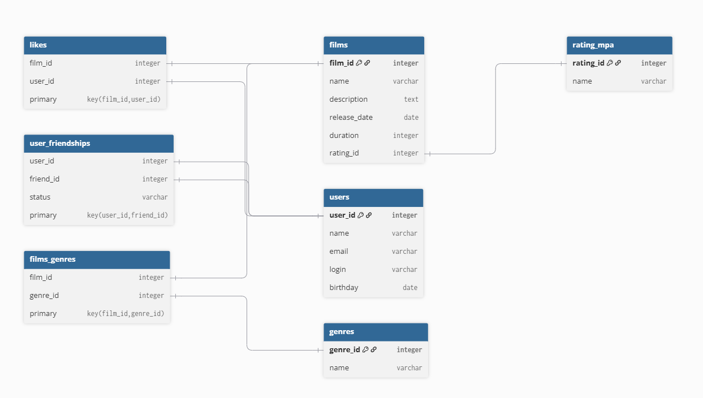

## ER-диаграмма к приложению Filmorate

  

## Примеры запросов:
### 1. Получить всех друзей пользователя с id 1:
    SELECT u.name, u.email, u.birthday
    FROM friends AS f
    INNER JOIN users AS u ON f.user_id = u.user_id
    WHERE u.user_id = 1;
### 2. Получить всех фильмов:
    SELECT f.film_id, f.name, f.description, f.release_date, f.duration, g.name AS genre, r.name AS rating
    FROM films AS f
    INNER JOIN genre AS g ON f.genre_id = g.genre_id
    INNER JOIN rating_mpa AS r ON f.rating_id = r.rating_id;
### 3. Получить всех пользователей кому понравился фильм с id 1:
    SELECT u.name, u.email, u.birthday
    FROM likes AS l
    INNER JOIN users AS u ON l.user_id = u.user_id
    WHERE l.film_id = 1;
### 4. Получить все фильмы с жанром "комедия":
    SELECT 
    FROM genre AS g
    INNER JOIN films AS f ON g.genre_id = f.genre_id
    WHERE g.name = "комедия";